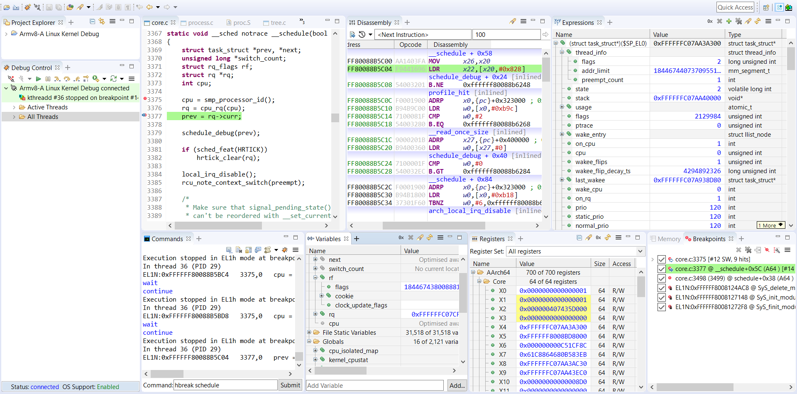
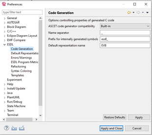
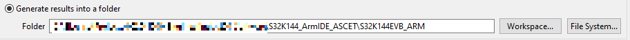
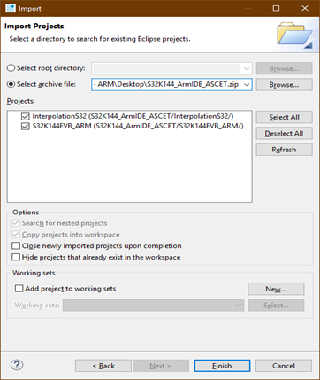
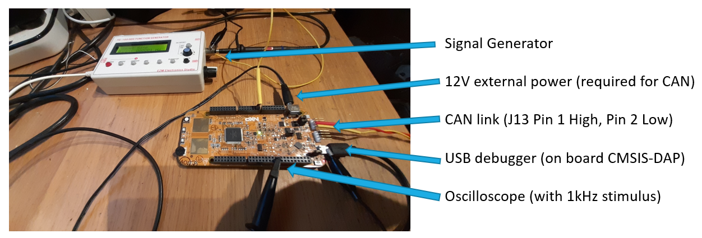
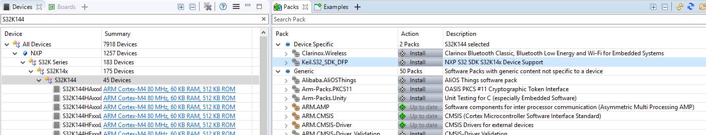
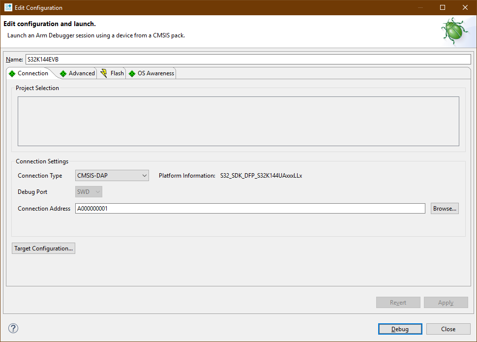

# Building and debugging ASCET-DEVELOPER generated code with Arm Development Studio

For more information on this example, please see this article:
xxx (link to blog)

ASCET-DEVELOPER is a model-based development and auto code generation tool for industrial control applications. For more information, including how to get an evaluation see:
https://www.etas.com/en/products/ascet-developer.php

Arm Development Studio is a comprehensive embedded C/C++ dedicated software development solution specifically for the Arm architecture, including the industry leading Arm Compiler. For more information, including how to get a fully featured 30-day evaluation, see:
https://developer.arm.com/tools-and-software/embedded/arm-development-studio

The example provided has been written to support the NXP S32K144EVB evaluation board:
https://www.nxp.com/design/development-boards/automotive-development-platforms/s32k-mcu-platforms/s32k144-evaluation-board:S32K144EVB

using the on-board CMSIS-DAP debug interface
https://arm-software.github.io/CMSIS_5/DAP/html/index.html

For technical assistance with ASCET, please contact ETAS : ec.support.de@etas.com

Country specific tech support links are mentioned here https://www.etas.com/en/company/contact.php

For questions on Arm Development Studio, public forums are available:

https://community.arm.com/developer/tools-software/tools/f/arm-compilers-forum

https://community.arm.com/developer/tools-software/tools/f/armds-forum

else contact arm-tool-solutions@arm.com

## ASCET-DEVELOPER setup

Unzip the downloaded package from ETAS Download server to your host PC.

Install below packages under folder install 
* ASCET-DEVELOPER
* Experiment Environment
* Virtual Prototype 

Start ASCET and create a new workspace

To simplify path naming, navigate to 
File > Preferences > ESDL > Code Generation
and change ‘Default Representation Name’ to EVB

## ASCET-DEVELOPER project import and configuration

Download the ASCET.zip file from this repository

Import the ASCET project from the menu system:
File > Import > General > Existing Projects into Workspace
Select the ASCET.zip file and click Finish

Change the folder into which code is generated match the Arm Development Studio workspace project
Run > Run Configurations
For example "C:\S32K144_ArmIDE_ASCET\S32K144EVB_ARM"

Click ‘Apply’, and then ‘Run’.
The code will now be auto-generated into your Development Studio project, within the ./src folder

For further instructions on how to write an ASCET Program and other functionality, open the user help (Menu Help > Help Contents).
Navigate to chapter ASCET-DEVELOPER User Guide > Getting Started and do the Tutorial (Highly recommended)

## Arm Development Studio setup and building project

Download Arm_DS.zip file from this repository.

Unzip this file, creating S32K144_ArmIDE_ASCET folder, and in the Development Studio IDE, navigate to
File > Switch Workspace
and select above S32K144_ArmIDE_ASCET folder.

Alternatively import projects (InterpolationS32 and S32K144EVB_ARM) from the zip file into another workspace via
File > Import >  General > Existing Projects into Workspace

Clean and rebuild the S32K144EVB_ARM project.
InterpolationS32 is a library used by this example (rebuilding library may take some time).

For more information on using Development Studio IDE functionality, see:
https://developer.arm.com/documentation/101470/latest/Working-with-projects

## Development board setup

Reflash EVB Debug processor to CMSIS-DAP as described in section 9 (page 8) of the below document:
https://www.keil.com/appnotes/files/apnt_299_v1.2.pdf

Move jumper J107 to connect pins 1 and 2 (instead of 2 and 3)

Connect the USB cable from your PC to the board

Provide a 12V supply on the IN 12V socket (required for CAN interface)

Additional inputs optional

## Debug setup and debugging the example project

Open the CMSIS Pack Manager perspective, and locate and install Keil.S32_SDK_DFP.
This provides necessary information to connect to and debug the evaluation board.

Double-click on debug configuration (S32K144EVB.launch) and browse for the CMSIS-DAP connection to the board.
Click debug to connect to target, and download the built image.

Subsequent connections can simply be done directly from the Debug Control pane.

Click continue to run the code on the target.

For more information on using Arm Debugger, see the Development Studio User Guide and other documentation:
https://developer.arm.com/tools-and-software/embedded/arm-development-studio/learn/docs
