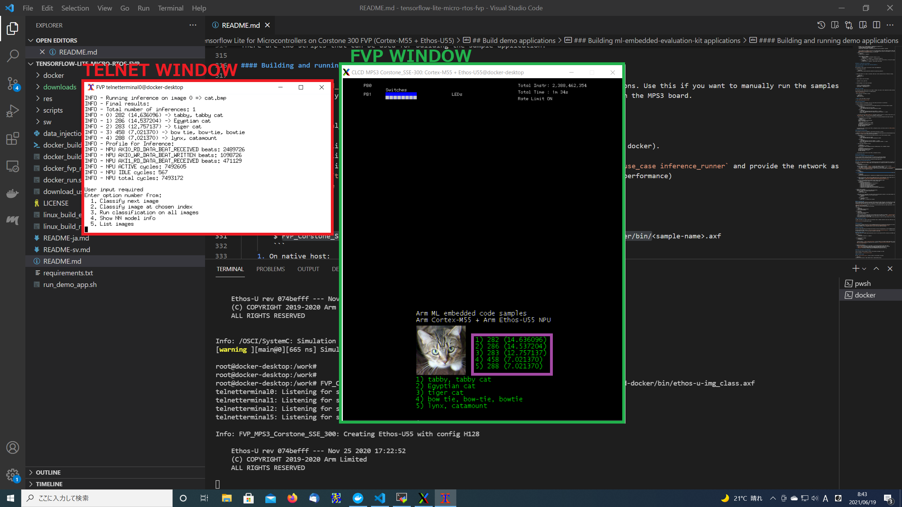
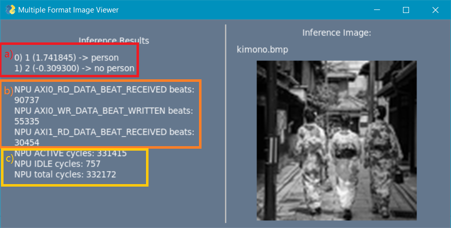

# Tensorflow Lite for Microcontrollers on Corstone 300 FVP (Cortex-M55 + Ethos-U55)

These instructions are available in the following languages
    
[ English](README.md) | 
[ 日本語](README-ja.md)

## 始めに

このレポジトリには、[Arm Ethos-U55 Micro NPU(uNPU)](https://www.arm.com/ja/products/silicon-ip-cpu/ethos/ethos-u55)ベースのプラットフォーム向けアプリケーションをビルド及び実行する環境をセットアップするための手順とスクリプトが含まれます。

[Arm Cortex-M55](https://www.arm.com/ja/products/silicon-ip-cpu/cortex-m/cortex-m55)をメインCPUとしてNPUに[Arm Ethos-U55](https://www.arm.com/ja/products/silicon-ip-cpu/ethos/ethos-u55)を搭載する[Corstone-300リファレンスプラットフォーム](https://developer.arm.com/ip-products/subsystem/corstone/corstone-300)をモデル化した Corstone-300FVP(Fixed Virtual Platform)をシュミレーションに利用しています。

Corstone-300FVPは無償で利用する事が可能です。Dockerを使った環境を提供しているので、入手性が良く、クラウド環境へのデプロイも容易で、再現性の高い環境構築が可能です。

このレポジトリにはTensorFlow Lite for Microcontroller(TFLM)ベースの機械学習の推論のためのいくつかのサンプルとニューラルネットワーク最適化ツール[Ethos-U Vela Optimizer](https://pypi.org/project/ethos-u-vela/)が含まれており、[Arm Cortex-M55](https://www.arm.com/ja/products/silicon-ip-cpu/cortex-m/cortex-m55)および[Arm Ethos-U55](https://www.arm.com/ja/products/silicon-ip-cpu/ethos/ethos-u55)プラットフォーム向けのアプリケーションの構築や実行を手軽に始めることができます。

では早速始めてみましょう。

---
## 目次

<!-- @import "[TOC]" {cmd="toc" depthFrom=1 depthTo=6 orderedList=false} -->

<!-- code_chunk_output -->

- [Tensorflow Lite for Microcontrollers on Corstone 300 FVP (Cortex-M55 + Ethos-U55)](#tensorflow-lite-for-microcontrollers-on-corstone-300-fvp-cortex-m55-ethos-u55)
  - [始めに](#始めに)
  - [目次](#目次)
  - [このキットで達成出来る事](#このキットで達成出来る事)
  - [事前準備](#事前準備)
    - [内容物と依存性](#内容物と依存性)
  - [環境の構築](#環境の構築)
    - [Option 1: Dockerを利用する場合 (推奨)](#option-1-dockerを利用する場合-推奨)
    - [Option 2: Linux環境を利用する場合](#option-2-linux環境を利用する場合)
      - [環境のセットアップ](#環境のセットアップ)
      - [Arm Compilerのインストール](#arm-compilerのインストール)
      - [GNUツールチェーンのインストール](#gnuツールチェーンのインストール)
  - [付属しているデモアプリケーションについて](#付属しているデモアプリケーションについて)
    - [ethos-u repository](#ethos-u-repository)
    - [ml-embedded-evaluation-kit repository](#ml-embedded-evaluation-kit-repository)
  - [アプリケーションのビルド](#アプリケーションのビルド)
    - [ml-embedded-evaluation-kit（キット）について](#ml-embedded-evaluation-kitキットについて)
    - [ビルドの開始](#ビルドの開始)
    - [ビルド結果の確認](#ビルド結果の確認)
    - [ビルド設定の変更](#ビルド設定の変更)
      - [ネットワークサンプルの変更](#ネットワークサンプルの変更)
      - [画像サンプルの追加や変更](#画像サンプルの追加や変更)
  - [アプリケーションの実行](#アプリケーションの実行)
    - [実行](#実行)
  - [ユーザーによる応用](#ユーザーによる応用)
    - [inference_runnerについて](#inference_runnerについて)
    - [データインジェクションの利用(実験的機能 armclangのみ対応)](#データインジェクションの利用実験的機能-armclangのみ対応)
    - [Telnetを使ったFVPへのログイン](#telnetを使ったfvpへのログイン)
    - [サンプルの追加](#サンプルの追加)
    - [マニュアルでのビルド](#マニュアルでのビルド)
  - [Ethos-U Vela Model Optimizerについて](#ethos-u-vela-model-optimizerについて)
    - [Vela Optimizerのインストール](#vela-optimizerのインストール)
    - [Vela Optimizer Report](#vela-optimizer-report)
    - [Vela Optimizerコンフィグレーション パラメータ](#vela-optimizerコンフィグレーション-パラメータ)
      - [1. クロック周波数とメモリコンフィグレーション](#1-クロック周波数とメモリコンフィグレーション)
      - [2. FVP_Corstone_SSE-300_Ethos-U55でのMACユニットの変更](#2-fvp_corstone_sse-300_ethos-u55でのmacユニットの変更)
      - [3. MACユニット](#3-macユニット)
  - [FreeRTOSを使ったアプリケーションのビルドと実行](#freertosを使ったアプリケーションのビルドと実行)
    - [FreeRTOS向けビルドと実行](#freertos向けビルドと実行)
    - [FreeRTOSに画像データとネットワークモデルを追加する](#freertosに画像データとネットワークモデルを追加する)
      - [モデルの変換](#モデルの変換)
      - [画像データの変換](#画像データの変換)
  - [タイミングアダプターを用いたメモリモデルの最適化（実験的機能）](#タイミングアダプターを用いたメモリモデルの最適化実験的機能)

<!-- /code_chunk_output -->

---
## このキットで達成出来る事

このキットは、事前に用意されたTensor Flow学習済みネットワークを元に、Vela Optimizerを使用し、各ネットワークのレイヤーをEthos-U55向けに最適化し、スケジューリングを行った上でtflile形式を生成し、そのtflile形式のネットワークをコンパイル可能なCppに変換します。変換したファイルを、アプリケーションソフトウェアへ組み込み、コンパイルによって生成された実行ファイルをCorstone-300のFVP、及び、FPGAサブシステムへ実装方する方法をMobilenet v2などのサンプルネットワークを使用して学ぶ事が出来ます。また、サンプル以外のネットワークを実装する方法についても学ぶ事が出来ます。更に、内蔵SRAMやFlashのスペックの変更、Ethos-U55のMAC/Cycle数の変更などのコンフィグレーションを変更し、FVPによるサイクル数の増減をシュミレーションする方法を学ぶ事が出来ます。

---
## 事前準備

デモアプリケーションはArm Compiler (version6.14以降)またはGNU Arm Embedded Tool Chain (version 10.2.1以降)でビルドが可能です。

* [注意] Arm Compiler(armclang)を起動するためには、正規ランセンス（有償）または30日評価ライセンス（無償）が必要です。ご利用の際はライセンスパスの環境変数`ARMLMD_LICENSE_FILE`を正しく設定する必要があります。評価ライセンスをご希望の場合は[30日間の無料トライアル](https://developer.arm.com/tools-and-software/embedded/arm-development-studio/evaluate)をご覧ください。

Dockerイメージをビルドすると、以下のパッケージがこのプロジェクトのルートにダウンロードされます。

* Arm Compiler 6.16 for Linux64: [DS500-BN-00026-r5p0-18rel0.tgz](https://developer.arm.com/-/media/Files/downloads/compiler/DS500-BN-00026-r5p0-18rel0.tgz)
* GNU Arm Embedded Toolchain: [gcc-arm-none-eabi-10-2020-q4-major-x86_64-linux.tar.bz2](https://developer.arm.com/tools-and-software/open-source-software/developer-tools/gnu-toolchain/gnu-rm/downloads)
* Corstore-300 FVP with Arm® Ethos™-U55 support for Linux64: [FVP_Corstone_SSE-300_Ethos-U55_11.14_24.tgz](https://developer.arm.com/-/media/Arm%20Developer%20Community/Downloads/OSS/FVP/Corstone-300/MPS3/FVP_Corstone_SSE-300_Ethos-U55_11.14_24.tgz)


### 内容物と依存性

このデモは下記の内容物と依存性を含みます。

* [Docker](https://www.docker.com/)
* [Tensorflow](https://github.com/tensorflow/tensorflow/)
* [CMSIS](https://github.com/ARM-software/CMSIS_5/)
* [FreeRTOS](https://github.com/aws/amazon-freertos.git) + [Kernel](https://github.com/FreeRTOS/FreeRTOS-Kernel.git)
* [vela](https://git.mlplatform.org/ml/ethos-u/ethos-u-vela)
* [ethos-u driver and platform](https://review.mlplatform.org/ml/ethos-u)
* [ml-embedded-evaluation-kit](https://review.mlplatform.org/ml/ethos-u/ml-embedded-evaluation-kit)
* [Corstone 300 FVP](https://developer.arm.com/ip-products/subsystem/corstone/corstone-300)

このデモで利用されているモデルとサンプル画像はオープンソースを利用しています。その他の個別のライセンス条件や詳細はソースコードのヘッダやREADMEをご参照ください。

---
## 環境の構築

このデモで利用されているスクリプトはCentOS7(コンソールもしくはDocker Container利用), Ubuntu 18.04(コンソールもしくはDocker Container利用)ならびにWindows 10 Powershell(Docker Container利用)で動作確認しています。

### Option 1: Dockerを利用する場合 (推奨)

0. Dockerのインストール
    * リンクの手順に従ってください。https://docs.docker.com/get-docker/

1. Linux コンソールもしくはWindows PowershellでDocker buildの実行:
    * Windows PowerShell:
        * Arm Compilerを利用する場合
            ```
            $> ./docker_build.PS1 -compiler armclang
            ```
        * GCC Compilerを利用する場合
            ```
            $> ./docker_build.PS1 -compiler gcc
            ```
    * Linux:
        * Arm Compilerを利用する場合
            ```
            $> ./docker_build.sh -c armclang
            ```
        * GCC Compilerを利用する場合
            ```
            $> ./docker_build.sh -c gcc
            ```

1. スクリプトが無事完了したら、以下のコマンドでDockerイメージを確認できます。
    ```
    $ docker images | grep "tensorflow-lite-micro-rtos-fvp"
    REPOSITORY                       TAG              IMAGE ID       CREATED          SIZE
    tensorflow-lite-micro-rtos-fvp   <compiler>       2729c3d6f35b   2 minutes ago   <size>
    ```

    * ビルド後にタグが`<None>`になるDockerイメージが生成されることがあります。これはビルド高速化に用いたキャッシュイメージです。以下のコマンドによって削除できます。
        ```commandline
        $ docker image prune -f
        ```
2. Arm Compilerを利用する場合には、Arm Compilerのライセンス`$ARMLMD_LICENSE_FILE`と環境変数`$ARM_TOOL_VARIANT`を正しく設定する必要があります。

3. Linuxにおいては、`$DISPLAY`の環境変数が正しく設定されていることを確認してください。これはアプリケーションのGUIを利用するために必要となります。

4. Docker containerを起動してbashを起動します(ご自分の環境に合わせて実行して下さい)。
    * Windows PowerShell:
        ```
        $ docker run --rm -it -e LOCAL_USER_ID=0 -e DISPLAY=<host-ip-address>:0.0 `
        -e ARMLMD_LICENSE_FILE=$env:ARMLMD_LICENSE_FILE `
        -e ARM_TOOL_VARIANT=$env:ARM_TOOL_VARIANT `
        --network host --privileged --rm tensorflow-lite-micro-rtos-fvp:<compiler> /bin/bash
        ```
        WindowsホストとDocker間でレポジトリやビルドフォルダを共有するために共有ボリュームを使いたい場合には、コマンドを変更することができます。(例: `-v $PWD\dependencies:/work/dependencies:rw`)Windowsをご使用の場合に、正しく動作しない場合があります。ビルドの問題がある場合には、先ず依存性のあるフォルダの共有を止めて試してください。

    * Linux:
        ```
        $> ./docker_run.sh -i <compiler>
        ```
        Linuxの場合はその他のコマンドラインオプションも利用出来ます。
        * -c : コマンドをDocker Containerに送る 
            ```
            $ ./docker_run.sh -i <compiler> -c ./linux_build_rtos_apps.sh
            ```
        * --share_folder : Docker containerとホストPCでフォルダを共有する（画像ファイルのコピーを簡便にする場合など）。
            ```
            $ ./docker_run.sh -i <compiler> --share_folder share_folder
            ```

### Option 2: Linux環境を利用する場合

***Ubuntu 18.04、20.04 と CentOS7 で動作確認済み***

#### 環境のセットアップ

いくつかのスクリプトにPythonとCMakeを使用しています。そのため、関係するdependenciesのインストールが必要です。

1. PythonとTkInterをインストールします。

    ```
    $ sudo apt install python3 python3-dev python3-venv python3-pip python3-tk
    ```

2. Python 3.6以降がインストールされていることを確認してください。以下のようにインストール済のバージョンを確認します。:

    ```
    $ python3 --version
    Python 3.6.8
    ```

3. Pythonの仮想環境を作成します。

    ```
    $ python3 -m venv .pyenv-tflm
    ```

4. パッケージを仮想環境にインストールします。
    
    ```
    $ source ./.pyenv-tflm/bin/activate
    $ pip install --upgrade pip setuptools
    $ pip install -r requirements.txt
    ```

5. CMake 3.15以降へのUpdate
このビルドではCMake 3.15以降が必要です。このレポジトリのスクリプトはCMake 3.15-3.20での動作が確認されています。


#### Arm Compilerのインストール

GCCの代わりにArm Compilerを使用する場合には、以下の手順でインストールを行ってください。

1. Arm Compiler(armclang)とCorstone SSE-300 FVPをインストールします。

    1. インストールが終了したらarmclangとCorstore SSE-300のインストールパスを環境に合わせて設定してください。
        * Temporary 
            ```
            $ export PATH=<armclang-install-dir>:$PATH
            $ export PATH=<FVP-install-dir>/models/Linux64_GCC-6.4:$PATH
            ```
        * Persistent
            ```
            $ echo "export PATH=<armclang-install-dir>:$PATH" >> ~/.bashrc
            $ echo "export PATH=<FVP-install-dir>/models/Linux64_GCC-6.4:$PATH" >> ~/.bashrc
            $ source ~/.bashrc
            ```

    2. armclangの起動には、`ARMLMD_LICENSE_FILE`の環境変数を設定してライセンスサーバーを指定し、`ARM_TOOL_VARIANT`で適切なVariantを選択してください。

    3. 先に進む前に、必ず以下の内容を満たしているかご確認下さい。

        - Arm Compilerのバージョンが6.14以降であること
            ```
            $ armclang --version
            Product: ARM Compiler 6.16 Professional
            Component: ARM Compiler 6.16
            ```
        - Corstone-300 FVPのバージョンが11.12以降であること
            ```
            $ FVP_Corstone_SSE-300_Ethos-U55 --version
            Fast Models [11.14.24 (Mar 23 2021)]
            Copyright 2000-2021 ARM Limited.
            All Rights Reserved.
            ```

起動に問題がある場合には、設定されたPATHが有効であるか、また`ARMLMD_LICENSE_FILE`と`ARM_TOOL_VARIANT`が正しく設定されているか、確認してください。

* [注意] Arm Compiler(armclang)を起動するためには、正規ランセンス（有償）または30日評価ライセンス（無償）が必要です。ご利用の際はライセンスパスの環境変数`ARMLMD_LICENSE_FILE`を正しく設定する必要があります。評価ライセンスをご希望の場合は[30日間の無料トライアル](https://developer.arm.com/tools-and-software/embedded/arm-development-studio/evaluate)をご覧ください。


#### GNUツールチェーンのインストール

Arm Compilerの代わりにGCCを使用する場合には、以下の手順でインストールを行ってください。

1. [Arm GNU toolchain](https://developer.arm.com/tools-and-software/open-source-software/developer-tools/gnu-toolchain/gnu-rm/downloads) とCorstore-300 FVPをインストールします。

    1. インストールが終了したらGCCとCorstore SSE-300のインストールパスを環境に合わせて設定してください。
        * Temporary 
            ```
            $ export PATH=<gcc-install-dir>:$PATH
            $ export PATH=<FVP-install-dir>/models/Linux64_GCC-6.4:$PATH
            ```
        * Persistent
            ```
            $ echo "export PATH=<gcc-install-dir>:$PATH" >> ~/.bashrc
            $ echo "export PATH=<FVP-install-dir>/models/Linux64_GCC-6.4:$PATH" >> ~/.bashrc
            $ source ~/.bashrc
            ```
    2. 設定されたパスが有効か、確認します。
        ```
        $ arm-none-eabi-gcc --version
        arm-none-eabi-gcc (GNU Arm Embedded Toolchain 10-2020-q4-major) 10.2.1 20201103 (release)
        ```
        ```
        $ FVP_Corstone_SSE-300_Ethos-U55 --version
        Fast Models [11.14.24 (Mar 23 2021)]
        Copyright 2000-2021 ARM Limited.
        All Rights Reserved.
        ```

起動に問題がある場合には、設定されたPATHが有効化か、確認してください。

## 付属しているデモアプリケーションについて

このプロジェクトは[ml-embedded-evaluation-kit repository](https://git.mlplatform.org/ml/ethos-u/ml-embedded-evaluation-kit.git/)または[ethos-u repository](https://git.mlplatform.org/ml/ethos-u/ethos-u.git/about/)を使ったアプリケーションのビルドを目的としています。

### ethos-u repository
これはArm Ethos-Uソフトウェアのレポジトリルートです。必要なレポジトリをダウンロードしてワークツリーを構成するために必要となります。

Corston-300 (Cortex-M55 + Ethos-U55)上で動作するいくつかの簡単なデモアプリケーションが用意されています。ベアメタルおよびFreeRTOSに対応しています。

- レポジトリの詳細
[https://git.mlplatform.org/ml/ethos-u/ethos-u.git/tree/README.md](https://git.mlplatform.org/ml/ethos-u/ethos-u.git/tree/README.md)
- Arm Ethos-Uの詳細
[https://developer.arm.com/ip-products/processors/machine-learning/arm-ethos-u](https://developer.arm.com/ip-products/processors/machine-learning/arm-ethos-u)

Ethos-uレポジトリをベースにしたFreeRTOS上で動作する追加のサンプルは`sw/ethos-u`フォルダに用意されています。

### ml-embedded-evaluation-kit repository
このレポジトリはArm Cortex-MとArm Ethos-U NPU向けに機械学習（ML）アプリケーションをビルドおよびデプロイするために必要です。

このソフトウェアを使って評価を行うには、[MPS3ボード](https://developer.arm.com/tools-and-software/development-boards/fpga-prototyping-boards/mps3)またはEthos-U55のFast Modelに対応しているFixed Virtual Platform (FVP)の使用をお勧めします。これらの環境では[Cortex-M55プロセッサ](https://www.arm.com/products/silicon-ip-cpu/cortex-m/cortex-m55)と[Ethos-U55 NPU](https://www.arm.com/products/silicon-ip-cpu/ethos/ethos-u55)を組み合わせた構成での評価が可能です。

ml-embedded-evaluation-kit(キット)には、以下のサンプルアプリケーションが含まれています。

* ad (Anomaly Detection)
* asr (Automatic Speech Recognition)
* img_class (Imange Classification)
* inference_runner (Run any quantized tflite network)
* kws_asr (Keyword Spotting and Automatic Speech Recognition)
* kws (Keyword Spotting)

その他、personal_detectionのサンプルも、レポジトリの`sw/ml-eval-kit`フォルダより利用いただけます。

---
## アプリケーションのビルド

### ml-embedded-evaluation-kit（キット）について

[ml-embedded-evaluation-kit](https://review.mlplatform.org/ml/ethos-u/ml-embedded-evaluation-kit)はArm® Ethos™-U55 NPUを評価するためのデモアプリケーションとビルド環境、サンプル画像が含まれています。Arm FVPとArm MPS3 FPGA Prototype ボードの両方で実行する事が可能です。本章ではml-embedded-evaluation-kit（キット）の内容を元に、ビルド、実行、評価を行います。


### ビルドの開始

`linux_build_eval_kit_apps.sh`スクリプトは、キット内のデモアプリケーションのダウンロードとビルドを行います。まずはデフォルト設定である`img_class`(MobileNet v2)を使ってビルドしてみましょう。

```commandline
$ ./linux_build_eval_kit_apps.sh
```
`linux_build_eval_kit_apps.sh` option紹介
* `--compiler`　ビルドに利用するコンパイラを設定します。
* `--model　<path/to/quantized/model.tflite>`  ネットワークを指定します。
* `--use_case`　どのユースケースをビルドするか設定します。サンプル外のカスタムネットワークをビルドする場合`--use_case inference_runner`を設定し、ネットワークを `--model <path/to/quantized/model.tflite>`と指定します。`inference_runner`については[ユーザーによる応用](#ユーザーによる応用)を参照下さい。
* `--help`　ヘルプを確認出来ます。

### ビルド結果の確認

ビルド完了後、AXFイメージファイルが生成された事を確認してください。
`dependencies/ml-embedded-evaluation-kit/build-docker/bin/ethos-u-img_class.axf`

ビルド時のログは`dependencies/log`にダンプされ、その中には[Vela Optimizer Report](#vela-optimizer-report)も含まれます。

### ビルド設定の変更
ここではビルド設定のデフォルト値からの変更について説明します。

#### ネットワークサンプルの変更
キットではデフォルトの`img_class`以外に、以下のサンプルアプリケーションが含まれています。

- ad (Anomaly Detection)
- asr (Automatic Speech Recognition)
- img_class (Imange Classification, MobileNet v2)
- inference_runner (Run any quantized tflite network)
- kws_asr (Keyword Spotting and Automatic Speech Recognition)
- kws (Keyword Spotting)

その他、personal_detectionのサンプルも、レポジトリの`sw/ml-eval-kit`フォルダより利用いただけます。それぞれのモデルの解説が`dependencies/ml-embedded-evaluation-kit/docs/use_cases`に準備されています。

`inference_runner`については[ユーザーによる応用](#ユーザーによる応用)を参照下さい。

#### 画像サンプルの追加や変更
キットにはサンプル画像が用意されています。ユーザーで用意した画像データを与えたい場合は、画像データをサンプルフォルダに追加してください。

- Person Detectionの画像追加: 
`sw/ml-eval-kit/samples/resources/person_detection/samples/`
- img_classの画像追加: 
`dependencies/ml-embedded-evaluation-kit/resources/img_class/samples/`
- その他サンプルの画像追加: 
`dependencies/ml-embedded-evaluation-kit/resources/<use_case>/samples/`


---
## アプリケーションの実行
前章[アプリケーションのビルド](#アプリケーションのビルド)で生成したバイナリを実行します。

### 実行
- Dockerで実施:
    ```commandline
    $ FVP_Corstone_SSE-300_Ethos-U55 \
    -a dependencies/ml-embedded-evaluation-kit/build-docker/bin/ethos-u-img_class.axf
    ```
- Host環境上で実施:
    ```commandline
    $ FVP_Corstone_SSE-300_Ethos-U55 \
    -a dependencies/ml-embedded-evaluation-kit/build/bin/ethos-u-img_class.axf
    ```

FVPはデフォルトでX11 Windowを利用します。もしHost側のX11 Window Clientになんだかの問題があり正しく描写されない場合、NO GUIモードを設定してください。
- No GUIモードでのFVP起動:
    ```commandline
        $ FVP_Corstone_SSE-300_Ethos-U55 \
            -C mps3_board.visualisation.disable-visualisation=1 \
            -C mps3_board.uart0.out_file=- \
            -C mps3_board.telnetterminal0.start_telnet=0 \
            -C mps3_board.uart0.unbuffered_output=1 \
            -C mps3_board.uart0.shutdown_on_eot=1 \
            -C mps3_board.uart0.shutdown_tag="releasing platform" \
            -a dependencies/ml-embedded-evaluation-kit/build/bin/ethos-u-img_class.axf
    ```

X11 Windowが設定されている場合、実行コマンドで下記の様なFVP WindowとTelnet Windowが起動されます。Telnet Windowから推論を実施したい項目を選択するとFVPで推論が開始され、推論が終了すると結果が表示されます。



---
## ユーザーによる応用
サンプルとして登録されているネットワーク以外でも量子化されたtfliteのネットワークであれば、キットに搭載されている`inference_runner`を使用して、アプリケーショに組見込みFVPやFPGA上で、動作させる事が出来ます。
更に、Ethos-U55のMAC/cycle数を変更することで、サイクル数がどの様に変わるかご確認頂けます。
データインジェクション機能(実験的機能)により、自動検証環境へのインテグレーションが容易になります。

### inference_runnerについて

`inference_runner`はユーザーが作成したtflite形式のネットワークをVela Optimizerに取り込むためのフロントエンドツールです。例として簡単な使い方を[Inference Runner Code Sample](dependencies/ml-embedded-evaluation-kit/docs/use_cases/inference_runner.md)で与えていますが、それを参考にユーザーによる改変が必要です。使い方の詳細については`dependencies/ml-embedded-evaluation-kit/docs/use_cases/inference_runner.md`をご覧ください。

### データインジェクションの利用(実験的機能 armclangのみ対応)
用意されたキットでは、推論の対象になる画像と推論ネットワークモデルの両方をビルドし、推論を実行する構造になっています。その為、ビルド後に新たに画像を追加する際は再ビルドが必要です。
この制約を回避する方法として、FVPが利用するバイナリを格納するメモリ領域をFVP外部から上書きする（データインジェクション）事により、ビルド後でも推論に使う画像を追加する機能があります。この機能は一般的にFVPの標準機能である`--data FILE@ADDRESS`オプションで実装されます。
データインジェクションの応用例として、ホスト側フォルダ内の画像やUSB WebCamからの画像をFVPのメモリ領域に割り当て、その画像に対してFVP側で逐次推論を実施する事などが考えられます。
この方法を用いる事で、推論ネットワークモデルの実行環境と、推論の対象になる画像を分離する事が出来るので、クラウド環境等を用いた自動検証に組み込むことが容易になります。

現在2つのサンプル(person_detection/img_class)に対してデータインジェクションを実施できます。`data_injection_demo.py`を利用します。

- Dockerで実施:
    ```
    $ source .pyenv-tflm/bin/activate
    $ ./data_injection_demo.py
    ```
- Host環境上で実施:
    ```commandline
    $ source .pyenv-tflm/bin/activate
    $ ./data_injection_demo.py --compiler=<gcc/armclang>
    ```
`data_injection_demo.py` option紹介
 * `--image_path=</full/path/to/image/or/folder>` デモにインジェクトすべき画像を指定します 

 * `--use_camera=True` ホスト側USBカメラからの静止画像をインジェクトします。ビデオストリーム入力を行う場合は、静止画像に変換してからインジェクトする必要があります。ビデオストリームを直接扱うことは出来ません。

データインジェクションモードで推論を実行すると下記の様なWindowが立ち上がり、(a)推論結果, (b)メモリread/Writeカウント,(c)NPUサイクルカウントが表示されます。 




### Telnetを使ったFVPへのログイン
サンプルデモ実行中のFVPにTelnetを使ったログインが可能です。Terminalを立ち上げて、FVPにTelnet接続をします。

```commandline
$ telnet localhost 5000
```

Docker利用時はまず最初にDocker containerにattachしてからTelnet接続を行います。

```commandline
$ docker ps
$ docker exec -it <container-id> /bin/bash
```

FVPのTelnet機能については[Fast Models Fixed Virtual Platforms (FVP) Reference Guide](https://developer.arm.com/documentation/100966/latest/)をご覧ください。

### サンプルの追加

ml-embedded-evaluation-kit（キット）内で、ユースケースとなっているアプリケーションの構造を参考に、ご自身のデモアプリケーションを追加します。

sw/ml-eval-kit/samples/source/use_case/person_detectionに格納されているperson_detectionのデモは、img_classのユースケースの派生になります。
同じような構造にして頂く事で、容易にカスタムデモを開発して頂けます。

### マニュアルでのビルド

今回のデモはArmがリリースしているml-emedded-evaluation-kit（キット）のラッパーになっています。ラッパーを使わずに直接[ml-emedded-evaluation-kit](`https://git.mlplatform.org/ml/ethos-u/ml-embedded-evaluation-kit.git`
)を利用する事も可能です。 デモで利用されているDocker containerはml-emedded-evaluation-kit（キット）の利用ガイドに準拠しており、互換性を持ちます。

---
## Ethos-U Vela Model Optimizerについて

VelaはTensorFlow Lite for Microcontroller(TFLM)で用意されたニューラルネットワークをArm Ethos-U NPU向けに最適化するためのツールで、オープンソースとして提供されています。Ethos-U NPUの性能を引き出すためには、事前にニューラルネットワークが`(u)int 8` もしくは`(u)int 16`に量子化されている必要があります。サポートしているTensor FLow versionについては、最新の[ethos-u-vela project](https://pypi.org/project/ethos-u-vela/)を確認ください。

Velaの利用例としては:<br>
```commandline
$ vela <input_model.tflite>
```
Vela Optimizerの実行ログは`output`に保存されています。

### Vela Optimizerのインストール

[ethos-u-vela project](https://pypi.org/project/ethos-u-vela/)はpipからインストール可能です。ソースコードならびに過去のVersionは[ethos-u/ethos-u-vela.git](https://git.mlplatform.org/ml/ethos-u/ethos-u-vela.git/)よりアクセス可能です。

- システム要件
Python v3.6 or above. (virtualenvによる設定を推奨)

- Pythonの準備:
    ```commandline
    $ sudo apt update
    $ sudo apt install -y python3 python3-venv python3-dev python3-pip
    ```

- virtualenvを使ったVelaのインストール

    ```commandline
    $ python3 -m venv .pyenv-tflm
    $ source ..pyenv-tflm/bin/activate
    $ python -m pip install ethos-u-vela
    ```

### Vela Optimizer Report

Vela Optimizerは最適化実施時に静的分析結果をレポートします。このレポートを使えば、FVPやMPS3 FPGA Prototype ボードでバイナリを実行する前にある程度の性能を見積もることが出来ます。例えばデフォルトで使われる`img_class`(MobileNet v2)のレポートを見てみましょう。

1. ネットワークの実行に必要なSRAMサイズと、不揮発メモリにストアされるネットワークのバイナリサイズ(U55ドライバ含む)は下記の様に見積もられます。

    ```
    Total SRAM used                    638.62KiB
    Total Off0chip Flash used         3139.81KiB
    ```

2. ネットワークに含まれるオペレータがU55で実行されるのか、ホストCPUであるCortex-M55で実行されるのか(Operator falling back)の割合が確認できます。サンプルに付属しているMobileNet v2はすべてのオペレータがU55にマッピングされる様に事前調整したネットワークなので、Vela Optimizer実施後もFalling backは`0%`と報告されています。Falling backの値は`0％`が理想値です。Falling backが増えると推論実行時にU55-Host CPU間のデータ受け渡しが頻繁に発生する事を意味し、実行性能低下の原因になり得ます。

    ```
    0/238 (0.0%) operations falling back to the CPU
    ```

3. メモリバンド幅、U55クロック周波数、MAC数などの条件から、静的に予想されたinference/sをレポートします。[Vela Optimizerコンフィグレーション パラメータ](#vela-optimizerコンフィグレーション-パラメータ)により、条件を変更させる事も可能です。

    ```
    Batch Inference time       14.46 ms, 69.14 inference/s (batch size 1)
    ```

### Vela Optimizerコンフィグレーション パラメータ

Vela Optimizerでは様々なパラメータの設定が可能です。パラメータ設定によりネットワークの最適化時点でのおおよそのU55実行性能を静的に見積もる事が出来ます。コンフィグレーションファイルのサンプルはこちら。
`./dependencies\ml-embedded-evaluation-kit\scripts\vela\default_vela.ini`

このファイルを変更するか、新たに作る事によって、Vela OptimizerにU55の構成とそのメモリシステムの特徴量を与える事が出来ます。

#### 1. クロック周波数とメモリコンフィグレーション
コンフィグレーションファイル内ではU55の動作周波数`core_clock`はデフォルトで500MHzに設定されています。このパラメータはVela OptimizerでU55実行性能を静的に見積もる際に利用されます。

メモリコンフィグレーションをコンパイル時に与える事により、メモリバンド幅による性能依存性を見積もる事が出来ます。パラメータ `Sram_clock_scale`と `OffChipFlash_clock_scale`がそれぞれAXI-M0バスに接続されたSRAM、AXI-M1に接続されたFLASH(不揮発性メモリ)へのアクセスサイクルを`core_clock`比で決定します。U55のAXI-M0バス、AXI-M1バスはそれぞれ64bit-AXI5のデータ幅を持ちます。デフォルト値では`4 GB/s`のSRAM帯域と`0.5 GB/s`のFLASH帯域をVela Optimizerに与えています。

ただしこれらのパラメータはVela OptimizerでU55実行性能を静的に見積もる際にのみ利用され、最適化の結果には影響を及ぼしません。実行結果にメモリモデルを反映したい場合は[タイミングアダプターを用いたメモリモデルの最適化（実験的機能）](#タイミングアダプターを用いたメモリモデルの最適化実験的機能)の利用をご検討下さい。

#### 2. FVP_Corstone_SSE-300_Ethos-U55でのMACユニットの変更
FVP_Corstone_SSE-300_Ethos-U55で利用されているMAC UnitはFVPのランタイムオプションで変更可能です。デフォルト値は`128`に設定されています。

```commandline
$  FVP_Corstone_SSE-300_Ethos-U55 -l | grep ethosu.num_macs
```

例えばMAC Unitを256に変更する場合は、FVPのランタイムオプションに下記の設定を追加します。

```commandline
$ FVP_Corstone_SSE-300_Ethos-U55 \
    -C ethosu.num_macs=256
```

#### 3. MACユニット
Vela OptimizerではEthos-U55のMACはデフォルト値として`128`を想定しています。
一方Ethos-U55 IPでは、論理合成オプションとしてMAC Unitを32,64,128,256(MAC/cycle)から選択する事が可能です。その為、実機もしくはFVPのEthos-U55 MAC Unitコンフィグレーションをデフォルト値である`128`から変更する場合は、Vela Optimizerコンフィグレーションパラメータも同時に設定する必要があります。その際は`--accelerator-config`オプションを利用します。

- `--accelerator-config`: 
    `ethos-u55-256`, `ethos-u55-128`(デフォルト値),`ethos-u55-64`,`ethos-u55-32`


Vela Optimizerの技術詳細については [Vela Documentation](https://git.mlplatform.org/ml/ethos-u/ethos-u-vela.git/about/) および [Vela command line example](https://git.mlplatform.org/ml/ethos-u/ml-embedded-evaluation-kit.git/tree/docs/sections/building.md#optimize-custom-model-with-vela-compiler) をご確認下さい。

---
## FreeRTOSを使ったアプリケーションのビルドと実行
幾つかのデモ用にFreeRTOSの環境が準備されています。FVPまたはMPS3 FPGA Prototype ボードを用いてFreeRTOS上で実行可能です。

### FreeRTOS向けビルドと実行
1. FreeRTOSのビルド
    ```commandline
    $ ./linux_build_rtos_apps.sh -c <compiler>
    ```

1. person_detectionの実行
    ```commandline
    $ ./run_demo_app.sh 
    ```

    * デフォルトでは`person_detection`サンプルが使われています。ビルドされたデモとライブラリは`dependencies/ethos-u/build/bin/`,`dependencies/ethos-u/build/applications/`にあります。


1. 実行結果の分析<br>
    1. [Person Detection](sw/ethos-u/samples/person_detection/README.md#run-application-with-fvp)
    1. [Hello TFLM](sw/ethos-u/samples/hello_tflm/README.md#run-application-with-fvp)
    1. [Mobilenet V2](sw/ethos-u/samples/mobilenet_v2/README.md#run-application-with-fvp)

### FreeRTOSに画像データとネットワークモデルを追加する

Tensor Flow Lite for Microcontollerモデル(.tflite)と画像はarmclang/gccでコンパイル可能な形式に変換し、そのソースを組み込んでビルドする必要があります。変換を手助けするためのスクリプトが用意されています。

* Docker: 
    `/usr/local/convert_scripts`
    
* Linux: 
    `scripts/convert_scripts`

#### モデルの変換

`convert_tflite_to_cpp.sh`はtfile形式のネットワークをコンパイル可能なCppに変換します。

```commandline
$ convert_tflite_to_cpp.sh --input <model.tflite> --output model_vela.cpp
```


変換後はビルドフォルダにコピーし、(ie, `sw/ethos-u/samples/mobilenet_v2`), 再ビルドしてください。

#### 画像データの変換

`convert_images_to_cpp.sh`はRGBもしくはGrayscale形式の画像データをコンパイル可能なCppに変換します。

- RGB形式の場合:
    ```commandline
    $ convert_images_to_cpp.sh \
        --input <image_folder> \
        --output <output_folder> \
        --width <new_width> \
        --height <new_height>
    ```
- Grayscale形式の場合:
    ```commandline
    $ convert_images_to_cpp.sh \
        --input <image_folder> \
        --output <output_folder> \
        --width <new_width> \
        --height <new_height> \
        --grayscale 1
    ```

変換後はビルドフォルダにコピーし、(ie, `sw/ethos-u/samples/mobilenet_v2`), 再ビルドしてください。

---
## タイミングアダプターを用いたメモリモデルの最適化（実験的機能）

タイミングアダプターはU55メモリモデルの実行性能への依存性を評価するための、ソフトウェアライブラリです。実験的機能である事をご理解の上、ご利用ください。

タイミングアダプターはメモリアクセスサイクルを調整する事で、TCM/In-SRAM/FLASH/MRAMといった特徴の異なる組み込み向けメモリを利用した際のシステムパフォーマンスを再現します。Cortex-M向けソフトウェアライブラリとして用意されており、コンパイル時に実装されるので、FVP/FPGAといったハードウェアプラットフォームに非依存です。ただしメモリアクセスを再現するためのソフトウェアライブラリをシステムに追加する必要があるので、侵襲性(Invasive)を持ったデバッグ機能です。

Ethos-U55は2つのAXIポート(M0,M1)を持ち、M0はRead-Write,M1はRead-Onlyの機能を有します。タイミングアダプターではM0,M1の挙動に対して個別の設定が可能です。

* AXI0-M0はRAMアクセスに利用されます。デフォルト設定ではread/write latancy=`32 cycles`, bandwidth=`4 GB/s`に設定されています。
* AXI1-M1はFLASH(もしくは不揮発性メモリ)アクセスに利用されます。デフォルト設定ではread/write latancy=`64 cycles`, bandwidth=`0.5 GB/s`に設定されています。

- タイミングアダプターコンフィグ: 
    `./dependencies\ml-embedded-evaluation-kit\scripts\cmake\ta_config.cmake`

AXIバス上のRead/Writeレイテンシは`TAx_RLATENCY`、`TAx_WLATENCY`で変更します。
AXIバス上のRead/Writeバンド幅は`TAx_PULSE_ON`、`TAx_PULSE_OFF`、`TAx_BWCAP`で変更します。

例えば:
```
BW_multiplier = TAx_BWCAP / (TAx_PULSE_ON + TAx_PULSE_OFF)
BW = BW_multiplier * 4 GB/s
```

この結果、デフォルトSRAMでは`BW_multiplier=1`に設定されます。その際のメモリバンド幅は`4 GB/s`です。デフォルトFLASHでは`BW_multiplier=0.125`に設定されます。その際のメモリバンド幅は`0.5 GB/s`です。もしバンド幅を `0.25 GB/s`に設定したい際は、`BW_multiplier=0.0625`になる様に設定します。

例えば: 
```
TAx_BWCAP=25
TAx_PULSE_ON=320
TAx_PULSE_OFF=80
```

タイミングアダプターの詳細はこちらから: 
[Timing Adapter Documentation](https://git.mlplatform.org/ml/ethos-u/ml-embedded-evaluation-kit.git/tree/docs/sections/building.md#building-timing-adapter-with-custom-options) 

---
