# Getting Started with Arm Virtual Hardware

*Accelerating MLOps in the cloud*

This README is a set of instructions for the [Introductory IoT DevOps workshop](https://www.arm.com/company/contact-us/virtual-hardware).

**Table of contents**

1. [Prerequisites](#prerequisites)
2. [Accessing and launching the AMI](#amilaunch)
    - 2.1 [Find AMI on AWS Marketplace](#marketplace)
    - 2.2 [(Alternative) Launch the AMI from AWS EC2](#launch)
    - 2.3 [Enable AMI console](#console)
    - 2.4 [(Optional) Enable Code Server](#codeserver)
    - 2.5 [(Optional) Enable Virtual Network Computing (VNC)](#vnc)
3. [Import and build example](#buildexample)
    - 3.1 [Fork and clone example](#clone)
    - 3.2 [Build example within the AMI](#build)
    - 3.3 [Run the example in place](#run)
    - 3.4 [Edit example](#edit)
    - 3.5 [Submit changes back to GitHub](#push)
4. [Automated CI/CD with GitHub Actions](#actions)
    - 4.1 [Configure GitHub Actions](#confactions)
    - 4.2 [Setup runner on AMI](#runner)
    - 4.3 [GitHub Actions workflow](#workflow)
    - 4.4 [Demonstration of a failed workflow](#failure)
5. [To go further](#further)

## 1. Prerequisites

* a valid [AWS](https://aws.amazon.com/) account
* a valid [Github](https://github.com/) account
* a SSH (VNC) client installed: e.g. [PuTTY](https://www.chiark.greenend.org.uk/~sgtatham/putty/latest.html), [MobaXterm](https://mobaxterm.mobatek.net/)

## 2. Accessing and launching the AMI

### 2.1. Find AMI on AWS Marketplace

1. Log into your [AWS account](https://aws.amazon.com/) and select *AWS Marketplace Subscriptions* service
2. Go to *Discover products* and search for *Arm Virtual Hardware* (with spaces)

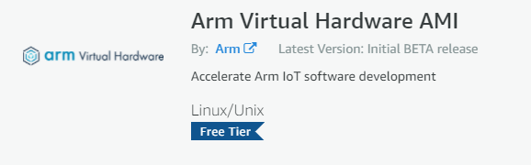

3. Click on *Continue to subscribe to the AMI* > *Continue to configuration* > *Continue to launch*
4. Choose **c5.large** instance type. This type has 2 powerful vCPU and 4 GB of RAM which is enough resources to run the AMI and simulation fast.

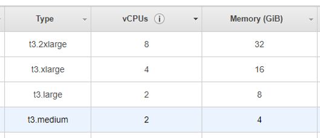

5. If you don't have a VPC (Virtual Private Cloud network) already, click on *Create a VPC in EC2 * in the corresponding section. In the *Your VPCs* interface, click on *Actions* > *Create default VPC* in the top-right corner.

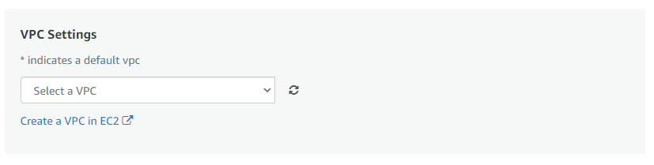

6. If you don't have a Security Group already, click on *Create new security group based on seller settings* in the corresponding section. This will allow SSH connection to the instance. Add a name and description to save it.

7. If you don't have a Key Pair already, click on "Create a key pair in EC2" in the corresponding section. A SSH key pair correspond to a public key that will be copied on the server side (the running AVH AMI instance) and a private key needed by a client to connect to it (your local machine). In the *Key pairs* interface, click on *Create a pair* in the top-right corner and follow the default steps to download the private key that you will need to connect.

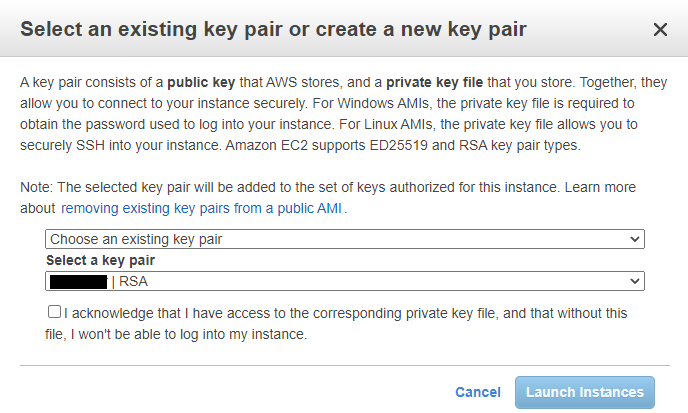

8. Click on *Launch*. You will see a "Congratulations" message to inform you that the instance was successfully deployed. Click on the link provided "You can view this instance on EC2 Console" to check the instance status and retrieve its *Public IPv4 address*.

### 2.2. (Alternative) Launch the AMI from AWS EC2

1. Log into your [AWS account](https://aws.amazon.com/) and select *Elastic Compute Cloud (EC2)* service
2. Locate *Images > AMIs* in the sidebar
3. Search *Public Images* for *ArmVirtualHardware* (without spaces) and click on Launch.

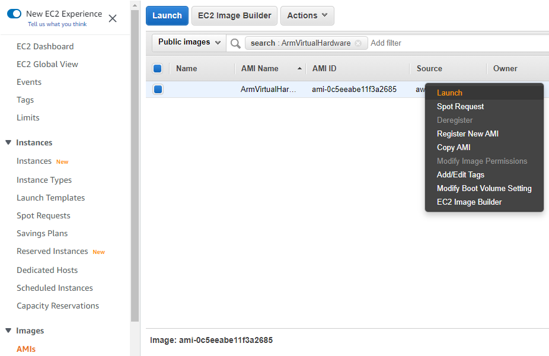

4. Follow the steps with the default options. If this has not been configured already, you will need to create a VPC, a new security group similar to what is described in [section 2.4](#marketplace).

8. Click on *Review and launch* > *Launch* to select or create a key pair (see [section 2.4](#marketplace)). You will see a message to inform you that the instance was successfully launched. Click on the *View instances* link provided to check its status and retrieve its *Public IPv4 address*.

### 2.3. Enable AMI console

To connect to the running instance, you will need its *Public IPv4 address*. If you don't have it already, you can get from the *EC2* > *Instances*.

Use SSH command on Linux, MacOS or [Windows Powershell](https://www.howtogeek.com/336775/how-to-enable-and-use-windows-10s-built-in-ssh-commands/):

        ssh -i <key.pem> ubuntu@<AMI_IP_addr>

Or, if using MobaXterm on Windows:

* Add new SSH session
* Specify `<AMI_IP_addr>` as *Remote host*
* Specify `ubuntu` as *username*
* Enable *Use private key* and specify path to `<key.pem>`

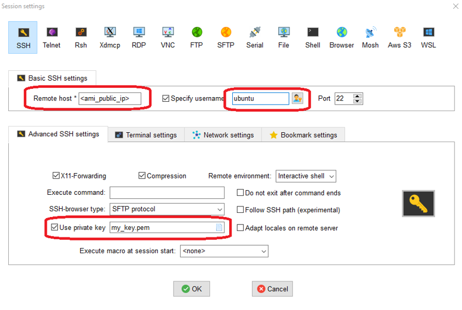

Or, if using PuTTY:

* Use **PuTTYgen** to convert the .pem file to .ppk
* Specify `ubuntu@<AMI_IP_addr>` in *Session > Host name*

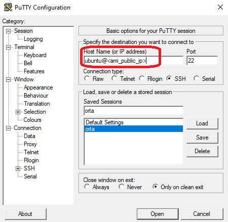

* Specify path to `key.pem` in *Session > Connection > SSH > Auth > Private key file for authentication*

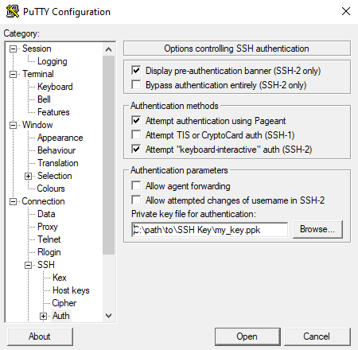

### 2.4. [Optional] Enable [Code Server](https://github.com/cdr/code-server) (Visual Studio Code)

The Arm Virtual Hardware AMI comes with an IDE (Visual Studio Code) which can be accessed with a web browser. To access it, you will need to:

1. Start a SSH tunnel to the instance and forward port 8080. On Linux, MacOS or [Windows Powershell](https://www.howtogeek.com/336775/how-to-enable-and-use-windows-10s-built-in-ssh-commands/):

    `ssh -i <key.pem> -N -L 8080:localhost:8080 ubuntu@<AMI_IP_addr>`

    The -N option holds the SSH tunnel connection and does not allow to execute other remote commands. This is useful for just forwarding ports.

    Or, with MobaXterm on Windows:

    * Add new SSH tunnel
    * Specify `8080` in *My computer > Forwarded port*
    * Specify `<AMI_IP_addr>`  in *SSH server*
    * Specify `ubuntu` in *SSH login*
    * Specify `22` in *SSH port*
    * Specify `localhost` in *Remote server*
    * Specify `8080` in *Remote port*
    * Save configuration. Click on the key icon to specify the path to `<key.pem>`
    * Start the tunnel connection

    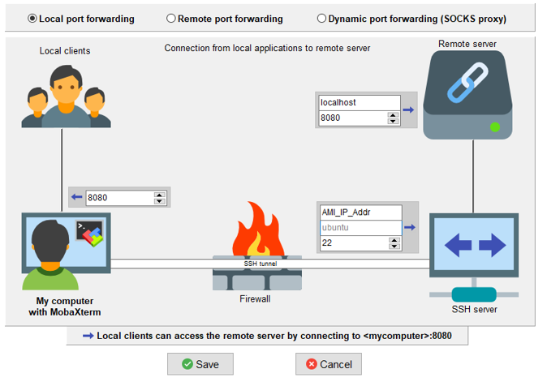

2. Launch a web browser on your local machine and open the following URL: [http://localhost:8080](http://localhost:8080)

### 2.5. [Optional] Enable Virtual Network Computing (VNC)

VNC is a protocol to enable remote desktop. The instruction below will securely enable VNC through a SSH tunnel.

In the AMI terminal:

1. Enable VNC password (no need to enter a view-only password)

    `vncpasswd`
    
2. Start the VNC server for the session

    `sudo systemctl start vncserver@1.service`

    To restart the VNC server after reboot
    
    `sudo systemctl enable vncserver@1.service`

On your local machine:

3. Forward port 5901 on local machine​. On Linux, MacOS or [Windows Powershell](https://www.howtogeek.com/336775/how-to-enable-and-use-windows-10s-built-in-ssh-commands/):

    `ssh -I <key.pem> -N –L 5901:localhost:5901 ubuntu@<AMI_IP_addr>​`

    Then, connect VNC client (e.g. Remmina, TigerVNC) to port 5901​. You will be prompted for password.

    Or, with MobaXterm on Windows:
    
    * Add new VNC session
    * Specify `localhost` as *Remote hostname*
    * Specify `5901` as *Port*
    * Select the *Network settings* tab configure the *SSH gateway* with:
        * `<AMI_IP_addr>` as *Gateway host*
        * `ubuntu` as *Username*
        * `22` as *Port*
        * Enable *Use SSH key* and specify path to `<key.pem>`

    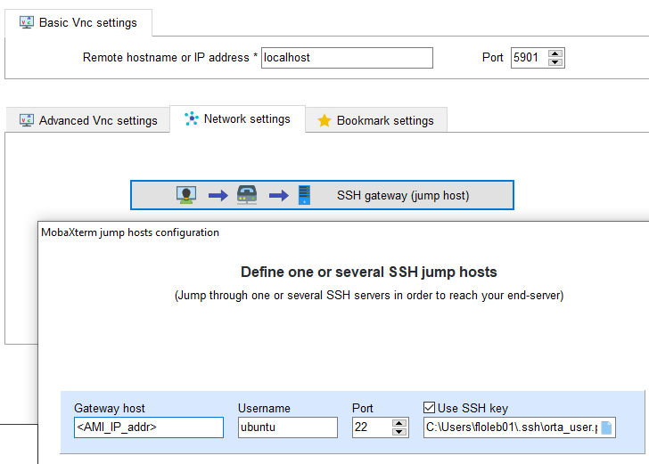

## 3. Import and build example

### 3.1. Fork and clone example

1. Open a web browser and enter the following URL: [https://github.com/ARM-software/VHT-TFLmicrospeech](https://github.com/ARM-software/VHT-TFLmicrospeech)
2. Log in to your github account and click on *Fork* (upper right)
3. In the AMI terminal:

        git config --global user.name YourGitHubName​
        git config --global user.email Your.Email@domain.com​
        git config --list​
        git clone https://github.com/<YourGitHubName>/VHT-TFLmicrospeech

### 3.2. Build example within the AMI

In the AMI terminal:

1. Navigate to build folder​

    `cd VHT-TFLmicrospeech/Platform_FVP_Corstone_SSE-300_Ethos-U55​`

2. Use [cp_install](https://arm-software.github.io/CMSIS_5/Build/html/cp_install.html) utility (do once) to install the necessary [CMSIS](https://developer.arm.com/tools-and-software/embedded/cmsis) Packs​ dependencies

    `cp_install.sh packlist​`

3. Use (cbuild)[https://arm-software.github.io/CMSIS_5/Build/html/index.html] to build the software project​ (this should take about a minute)

    `cbuild.sh microspeech.Example.cprj`

### 3.3. Run the example in place

In the AMI terminal:

1. Run script to load application to model and execute​

        ./run_example.sh
    

    This will run the application until it terminates (about a minute). You can terminate the simulation faster by specifying the number of cycles:

        ./run_example.sh --cyclelimit 100000000
    

2. Observe banner and output log​

        Fast Models [11.16.14 (Sep 29 2021)]​
        Copyright 2000-2021 ARM Limited.​
        All Rights Reserved.​
        
        telnetterminal0: Listening for serial connection on port 5000​
        telnetterminal1: Listening for serial connection on port 5001​
        telnetterminal2: Listening for serial connection on port 5002​
        telnetterminal5: Listening for serial connection on port 5003​
        
        Ethos-U rev afc78a99 --- Aug 31 2021 22:30:42​
        (C) COPYRIGHT 2019-2021 Arm Limited​
        ALL RIGHTS RESERVED​
        
        Heard yes (146) @1000ms
        Heard no (145) @5600ms
        Heard yes (143) @9100ms
        Heard no (145) @13600ms
        Heard yes (143) @17100ms
        Heard no (145) @21600ms
        
        Info: Simulation is stopping. Reason: Cycle limit has been exceeded.
        
        Info: /OSCI/SystemC: Simulation stopped by user.
        [warning ][main@0][01 ns] Simulation stopped by user
        
        --- cpu_core statistics: ------------------------------------------------------
        Simulated time                          : 23.999999s
        User time                               : 25.804117s
        System time                             : 3.336213s
        Wall time                               : 29.132544s
        Performance index                       : 0.82
        cpu_core.cpu0                           :  26.36 MIPS (   768000000 Inst)
        -------------------------------------------------------------------------------
​

### 3.4. Edit example

In the AMI terminal:

1. Navigate to source folder​

    `cd ../micro_speech/src/​`

2. Edit `command_responder.cc` using the nano text editor for example:

    `nano command_responder.cc`

    And change output (e.g. add your name as below)​

        TF_LITE_REPORT_ERROR(error_reporter, “YourName Heard %s (%d) @%dms", found_command, score, current_time);

3. Save (Ctrl+X with nano), rebuild (cbuild will just rebuild the files that have changed) and run to verify change​

        cd ../../Platform_FVP_Corstone_SSE-300_Ethos-U55​
        cbuild.sh microspeech.Example.cprj​
        ./run_example.sh​

### 3.5 Submit changes back to GitHub

In the AMI terminal

1. mark changed file(s) you wish to submit​

        cd ../micro_speech/src/​
        git add .​

2. Commit changes, with arbitrary message​

        git commit -m "Added my name to output message"

3. Verify the repository referenced is your forked copy​

        git remote -v​

4. Submit changes back to your repository​

        git push​

    You will be asked your login and Personal Access Token (password) information.
    
    To ​enable Personal Access Token in GitHub:
    
    - go to *Settings > Developer settings > Personal access tokens > Generate new token*
    - Enable **repo** to access the repository from the command-line
    - Generate and copy the token to provide

    In your own fork on Github, observe the change registered

    `https://github.com/<YourGitHubName>/VHT-TFLmicrospeech​/blob/main/micro_speech/src/command_responder.cc​`

## 4. Automated CI/CD with GitHub Actions

### 4.1. Configure GitHub Actions

In your own fork on GitHub

1. Navigate to *Settings > Actions > Runners*
2. Add `New self-hosted runner`

    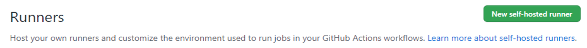

3. Select Linux, x64 Runner image and copy the commands to set up

    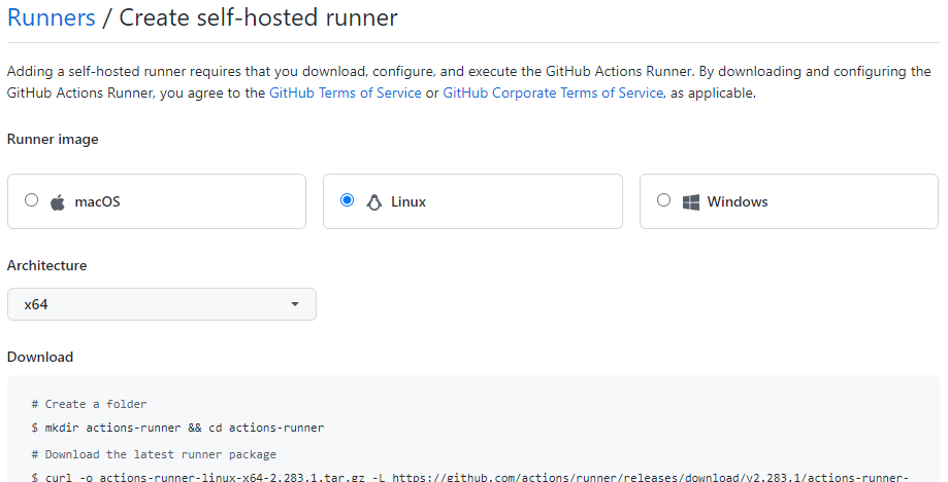

### 4.2. Setup runner on AMI

In the AMI terminal

1. Go to base directory

        cd /home/ubuntu

2. Copy the commands from GitHub to configure with default options (no need for a runner group name)
3. Once configured, use run.sh to start the runner on the AMI

        ./run.sh
        Connected to GitHub
        yyyy-mm-dd hh:mm:ss: Listening for Jobs

In Github, go the *Runner* tab to see the runner listed and idle

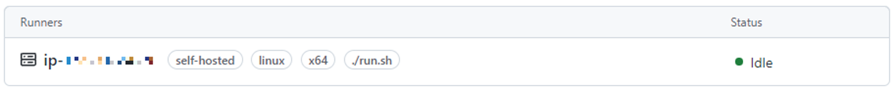

### 4.3. GitHub Actions workflow

1. In Github, the file .github/workflows/virtual_hardware.yml defines the list of actions to perform (e.g. code checkout, build, run test script) on the runner and when (e.g. for every push to the repo)

2. **In a new AMI terminal**, revert your change in command_responder.cc and push to the repo

        cd VHT-TFLmicrospeech/micro_speech/src
        git add .
        git commit -m "Original message"
        git push

3. **Back to the first AMI terminal where the runner has been started with ./run.sh**, the runner reports the status

        <timestamp>: Listening for Jobs
        <timestamp>: Running job: ci_demonstration
        <timestamp>: Job ci_demonstration completed with result: Succeeded

4. In GitHub, locate the *Actions* sections and inspect the history of the workflow runs on the AMI instance

    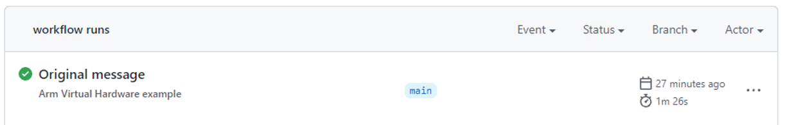

### 4.4. Demonstration of a failed workflow

1. Change the code to be non-valid C e.g. edit `command_responder.cc` and remove the semicolon at the end of the line:

        TF_LITE_REPORT_ERROR(error_reporter, “YourName Heard %s (%d) @%dms", found_command, score, current_time)

2. Commit change to GitHub

        git add .
        git commit -m "Example of failure"
        git push

3. Observe in AMI that the runner reports failure

        <timestamp>: Running job: ci_demonstration
        <timestamp>: Job ci_demonstration completed with result: Failed

    Same in GitHub's *Actions* tab

    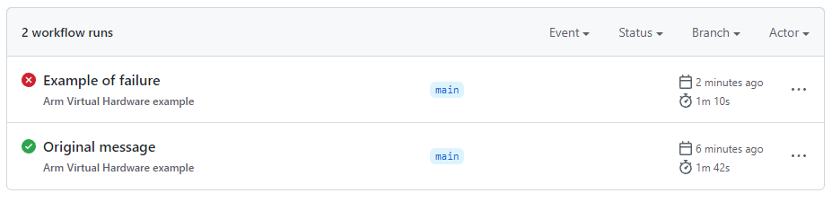

### 5. To go further

Arm Virtual Hardware enables the deployment of [Arm Total Solutions for IoT](https://www.arm.com/solutions/iot/total-solutions-iot), complete software stacks of general purpose compute and ML workloads.

The [Arm ML evaluation kit examples](https://review.mlplatform.org/plugins/gitiles/ml/ethos-u/ml-embedded-evaluation-kit/) can also be built and executed with the Arm Virtual Hardware AMI. The instructions in the [quick start guide](https://review.mlplatform.org/plugins/gitiles/ml/ethos-u/ml-embedded-evaluation-kit/+/HEAD/docs/quick_start.md) are easily reproducible in the AMI. You will need to enable VNC to visualize.

Have questions, comments, and/or suggestions? We invite you to take this brief [survey](https://www.surveymonkey.co.uk/r/ArmVirtualHardware) to provide feedback.
Alternatively please reach out to the Arm Development Tool Solutions team at [arm-tool-solutions@arm.com](mailto:arm-tool-solutions@arm.com)
